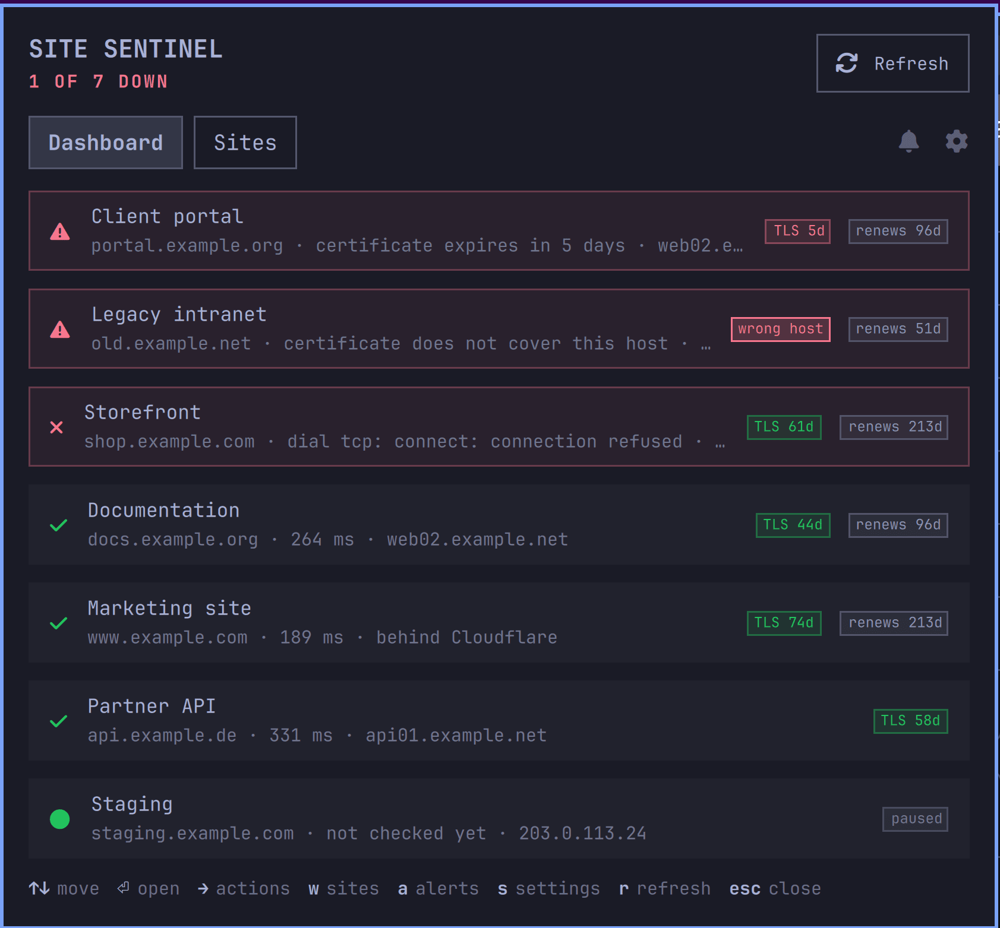

# Site Sentinel

An Omarchy bar widget that watches web sites from your own machine: whether each
one answers, what certificate it serves, where it resolves, and when its domain
renews.

The bar stays quiet while everything is fine and lights up when it is not. The
panel lists every site worst first, with days remaining on the certificate and
days to renewal beside each one.

## What it checks

| Tier | Default cadence | What it asks |
| --- | --- | --- |
| Reachability | 5 minutes | HTTP status, redirect chain, response time, and a string you expect on the page |
| DNS | 30 minutes | A and AAAA records, reverse DNS, nameservers, whether it sits behind a CDN |
| Certificate | 6 hours | Issuer, expiry, chain validity, whether it covers the hostname |
| Registration | daily | Expiry and registrar lock, over RDAP, falling back to WHOIS |

Every check is unauthenticated. Site Sentinel holds no credentials for any site
it watches and cannot log in anywhere.

Two things it is careful about:

- **A 200 is not proof.** A page returning 200 with a database error on it reads
  as healthy unless you give it a string to expect. `-expect` is worth setting.
- **Your uplink is not their outage.** If every site fails at the same instant
  at the transport layer, that is recorded as a local fault and alerts nothing.

## Install

    omarchy plugin add https://github.com/karamble/omarchy-site-sentinel
    omarchy plugin enable karamble.sitesentinel right
    omarchy-restart-shell

Only source is shipped, so the helper is compiled once on your machine. The
panel offers a **Build now** button, or from the plugin directory:

    cd ~/.config/omarchy/plugins/karamble.sitesentinel
    make

Requires the Go toolchain, 1.27 or newer. One direct dependency, the upstream
MCP SDK; every check itself is standard library.

Then add something to watch:

    ./bin/sentinel add https://example.com -expect "Welcome"

Nothing leaves your machine until you do. With no site configured the daemon
makes no network request at all.

## Using it

The panel is keyboard driven. `d` dashboard, `w` watched sites, `a` alerts,
`s` settings, `r` check now, `m` the master switch, `n` add, `x` remove,
arrows or `hjkl` to move, Enter to act, Escape to close.

From a terminal:

    sentinel status         one line per site, worst first
    sentinel certs          certificates, soonest to expire first
    sentinel domains        registrations, soonest to renew first
    sentinel add <url>      watch a site
    sentinel pause <site>   stop checking it without forgetting it
    sentinel remove <site>  stop watching and forget its history

Run `sentinel help` for the rest.

## Alerts

A watch waits for a condition and then wakes you once, or every time if you ask
for standing. Arm one from the panel, the command line or MCP:

    sentinel arm -path sites.downList -op appears -expires 30d -standing \
      -reason "shop is revenue critical"

`sentinel catalogue` lists every path a watch can be put on. The alarm carries
the condition, the time and your reason, and no values, so it stays true
whenever it arrives.

## For coding agents

Site Sentinel installs nothing into any agent's configuration. It prints its
guide when asked:

    sentinel skill              the guide
    sentinel skill -recipes     worked examples, one per operator

It can also serve MCP on loopback behind a bearer token. **That endpoint is off
until you switch it on**, in Settings or with `sentinel mcp-endpoint on`.

`sentinel mcp` prints the entry to paste into an agent's config, and
`sentinel recycle` mints a new token and shows the updated entry once, locking
out everything holding the old one. Eight tools read; six change the sentinel's
own site list and watches. None acts on a monitored site.

## Where it writes

Two places, and nowhere else:

- the plugin folder, for the compiled helper in `bin/`
- `~/.config/sitesentinel/`, for `sites.json`, `state.json` and `triggers.json`,
  all mode 0600 and written atomically

There is no systemd unit. The daemon is a child of the shell through the
plugin's service entry point, so disabling or removing the plugin stops it.

## Removal

Purge first, then remove, because the binary that purges lives in the folder
removal deletes:

    ~/.config/omarchy/plugins/karamble.sitesentinel/bin/sentinel purge
    omarchy plugin remove karamble.sitesentinel

`purge` deletes `~/.config/sitesentinel/` and everything in it. Skipping it
leaves your site list and API token behind, which is deliberate: removing a
plugin should not silently destroy configuration.

## Licence

ISC. See LICENSE.
